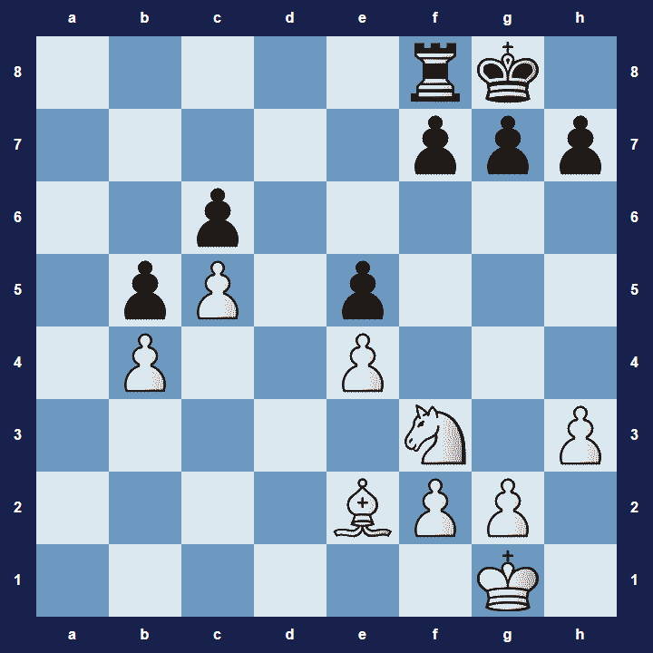

# Vizualizace šachovnice

Nástroj pro vizualizaci šachovnice ze cvičení [se zadáním zde](https://kodim.cz/kurzy/daweb/js1/chyby-pole/cv-pole#cvlekce%3Esachovnice).

Pro použití je potřeba složit URL, která ve výsledku může vypadat například takto [https://czechitas-podklady.cz/vizualizace-sachovnice/?s=[[0,0,0,0,0,-4,-6,0],[0,0,0,0,0,-1,-1,-1],[0,0,-1,0,0,0,0,0],[0,-1,1,0,3,0,0,0],[0,1,0,0,1,0,0,0],[0,0,0,0,0,0,0,1],[0,0,0,0,2,1,1,0],[0,0,0,0,0,0,6,0]]](https://czechitas-podklady.cz/vizualizace-sachovnice/?s=[[0,0,0,0,0,-4,-6,0],[0,0,0,0,0,-1,-1,-1],[0,0,-1,0,0,0,0,0],[0,-1,1,0,3,0,0,0],[0,1,0,0,1,0,0,0],[0,0,0,0,0,0,0,1],[0,0,0,0,2,1,1,0],[0,0,0,0,0,0,6,0]]).

Pro vytvoření URL je možné využít v JavaScriptu následující kód:

```js
const sachovnice = [
	[0, 0, 0, 0, 0, -4, -6, 0],
	[0, 0, 0, 0, 0, -1, -1, -1],
	[0, 0, -1, 0, 0, 0, 0, 0],
	[0, -1, 1, 0, -1, 0, 0, 0],
	[0, 1, 0, 0, 1, 0, 0, 0],
	[0, 0, 0, 0, 0, 3, 0, 1],
	[0, 0, 0, 0, 2, 1, 1, 0],
	[0, 0, 0, 0, 0, 0, 6, 0],
]

const zobrazOdkazNaSachovnici = (data) => {
	const url = `https://czechitas-podklady.cz/vizualizace-sachovnice/?s=${JSON.stringify(
		data,
	)}`
	document.body.innerHTML += `<p><a href="${url}">Odkaz na šachovnici: ${url}</a></p>`
}
zobrazOdkazNaSachovnici(sachovnice)
```


